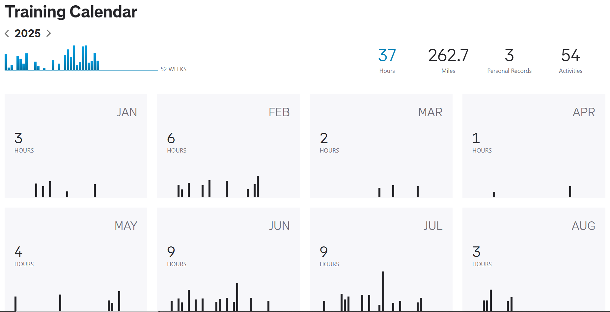
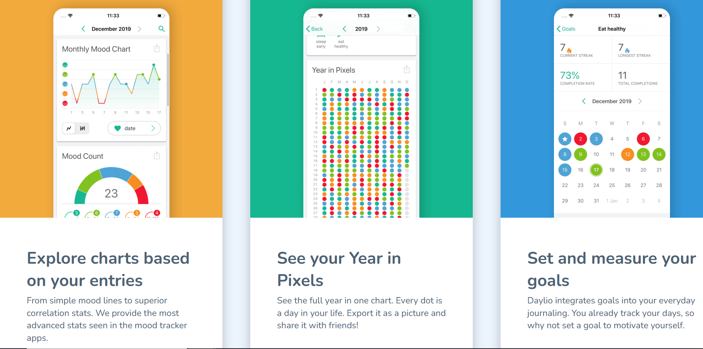
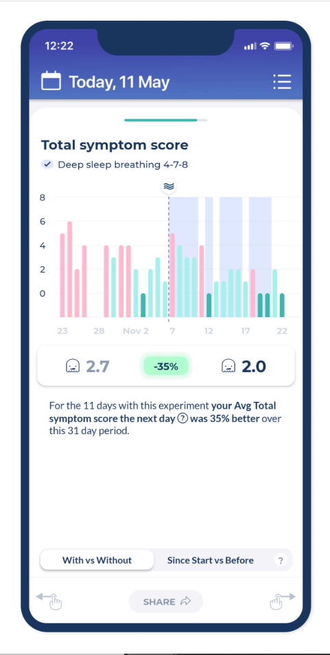

This app allows a user to track their running workouts along with their mood. It will provide these features to users unlike other apps that I found in my research. Tracking these together is important because it allows users to not only track their running and fitness goals, but also allows them to see their mood based on their exercise. It will be simple to use, but provide meaningful insights into how a user is feeling and exercising so they can achive their fitness and well-being goals.

### System Overview
- Allows users to create a to-do list for running and schedules it out for them on the calendar
- Allows a user to enter mood/energy level each day through a survey whether they run or not
- Gives feedback however often the user wants (by the week or month) based on how the user feels each day over that specific time period
- Track general trends about running and how it affects mood
- Track routes for runs based on gps
- A user can upload runs and see them and their statistics within the app
- Track mood and fitness trends over time for a particular user

## Similar Resources

### Running Aspect 

**Strava**
- I like the Strava training calendar or training log, need to be able to plan and indicate some sort of mood score for that day.
- Don't want the social aspect of Strava as I won't have enough time to integrate and learn about how that works.
- Good graphs and charts for running stats.

[Strava](https://www.strava.com/dashboard) [3] is one of the most popular running tracker apps out there. According to [11], it states that strava is very good for tracking personal workouts and get valuable data about their fitness. However, this review makes no mention of tracking the mood or mental health of a person. I personally use Strava and really like it. This picture of the training calendar is one that I am certainly going to attempt to take inspiration from because of the simplicity while also displaying information. 

### Mental Health and Wellness Aspect

**Daylio**
- Circles and things on the calendar. Take that and integrate with the Strava [3] calendar.
- Doesn't integrate fitness into it at all.
- Gives good overview with charts and graphs of mood and gives high level insights through colorful graphs. 

[Daylio](https://daylio.net/) [2] is a mobile app, but has good pictures to give ideas of what I could do with the mood tracker. This shows a good representation of what I want to also include on the Strava calendar with the dots on the months with colors that represent certain scores. 

**Bearable**
  - Super complex and not user-friendly
  - I like the weekly and monthly overview screen as well as the simple but insightful comments it gives about certain aspects of sleep in this instance. 

[Bearable](https://bearable.app/) [1] is the same as Daylio, it is a mobile app but provides good visualizations. 

{:width="300"}

## Technologies

### Platform 
I will be targeting a web app platform. This appears to be the best thing to do with the time that I have. I am somewhat familiar with web apps so it won't be as much of a learning curve as attempting to do an android app where I believe I would have to learn a lot more which would take up a lot of time.

### Programming Languages
I am going to be using **JavaScript** in React [4] for my UI stuff on the frontend. There really wasn't another option for the UI because I am doing a web app and through research I saw that you need to use Javascript for the web browers. I will also be using **HTML + CSS** for the UI stuff because I will be using Tailwind CSS. 

I chose to use **Python** on the backend with Flask [5] over the alternative of using Javascript with Node.js for this because it allows me to use a language I am very familiar with in Python and I can then focus my attention with Javascript on solely the UI stuff. This will allow me to save some time because I do not need to learn the entirety of Javascript.

I will be need to use **SQL** for my database because I am using PostgreSQL [7] as my database and in order to extract information I will need to use SQL. This choice was a pretty easy one because I have experience with it already so there should not be any sort of a learning curve when it comes to using it.

### Frameworks/Libraries

**GUI**

*React* [4] is going to be my choice for the UI stuff because it allows me to build a dynamic web app and is something that seems to be very common in the real world. This will be good to learn because it allows me to focus on only React [4] and not have to worry about juggling multiple libraries. Also, I will be using *React Router* as well for navigating through different tabs or pages on the website. For example, if you wanted to change the view from your running calendar to see statistics about your mood, you would need to click somewhere to switch tabs. This makes it much easier on me and the user.

Another technology for the GUI is *Tailwind CSS* which allows me to style my web app quicker than doing it from scratch. This will allow me to spend less time on how the app looks because of the ese of this process.

An interesting technology to use will be *Recharts* as well because I have never used it before and I'm excited to see what sort of charts and graphs I can produce. I chose this over over *charts.js* because recharts seems easier to use and will give me the necessary charts I need such as line charts and bar charts. I could potentially switch to charts.js depending on how much time I have if I want to add some more complex charts.

**Database**

*PostgreSQL* [7] will be the database I use because I have used it before in a past class so it will not be as much of a learning curve which will end up saving me time. This database selection is also very good for structered data like I will have in this app. *SQLAlchemy* [6] allows me to define my SQL tables as python classes so that my code looks cleaner and I don't have to constantly see long SQL queries. I am excited to learn how to integrate this into my project as it seems like it will make my analysis about mood and running far easier when querying the database.

**Domain**

I am going to use *Flask* [5] because I already have experience with Python and using Flask [5] from a previous class. This also allows me to use REST APIs easily so that I can use the one from Strava [3] as well. I will also be using *Flask-CORS* along with Flask [5] because it allows my React [4] frontend to be able to communicate with the Flask [5] backend. CORS stands for Cross-Origin Resource Sharing.

### Hosting

Frontend: I am going to host my frontend of *React* on Vercel [8] because of its *ease of use with React*, it is easy to integrate with Git, and I don't have to configure my own servers as it does this automatic. I chose Vercel over something like Netlify because it integrates better with React while still being great for frontend hosting.

Backend: I chose to use Render [9] for my backend hosting because of its *ease of support* with Flask and Python integration. It also gives me the ability to host my database if I end up not liking Neon. I chose this over something like Heroku because Heroku limits you a lot with the free version, while Render gives me all the customization and options I may need with its free version.

Database: Neon [10] was my choice to host my database because it is **cloud-based and serverless** which allows it to be scaled up and down automatically. It also looks easy to use and integrates well with SQLAlchemy and Flask. I am choosing Neon over something like Supabase because it is much lighter and simple. I don't need all of the extra stuff Supabase provides such as authenticating, storage, and API because of my use of Flask.

### Package/ Dependency Manager

My frontend dependency manager will be npm because it is the *standard for react* as it comes with Node.js. I am using npm over Yarn because it is simple and I don't have to make a bunch of extra decisions like I would with Yarn.

I am using pip as my backend dependency manager because it is the *default with python* and it is also very simple and easy to use. I am choosing it over Poetry not only because it comes with Python but it also isn't as big of a learning curve as Poetry.

## Deployment / Distribution

### Frontend → React + Tailwind (UI) over plain HTML + CSS

I am choosing to use *React* [4] because it allows me to use Javascript which is necessary to use for web browers. *Tailwind* allows me to customize my app in a simple way. I could have used plain HTML + CSS, but it appears that it gives me more code to manage and isn't as modern. Another reason I want to use React [4] is so I can learn how to use it because it is very popular in the real world and would be a good thing to know for after I graduate.

### Backend → Choosing Flask over Node.js + Express

I am going to use Flask [5] over the alternative Node.js and Express because of my experience with python and it will allow me to *limit my use of Javascript to UI stuff*. Also, Flask [5] does very well with **data-heavy** features which I am going to have a lot of within this app. I am also able to easily integrate the Strava API that I want to use for bringing in running data.

### Database → PostgreSQL over MariaDB

I am going to use the PostgreSQL [7] over MariaDB because it works very well with the SQLAlchemy [6] that I want to use. PostgreSQL [7] also seems to handle large data better as well as working better with analytics which will be a key part of my project. It also handles advanced queries a bit better which could be key for the analytical side of my project.

## References
[1] Bearable, “Bearable App,” 2025. [Online]. Available: https://bearable.app/.

[2] Daylio, “Daylio Mood Tracker Journal,” 2025. [Online]. Available: https://daylio.net/.

[3] Strava, “Strava Dashboard,” 2025. [Online]. Available: https://www.strava.com/dashboard.

[4] Meta, “React Documentation,” ReactJS, 2025. [Online]. Available: https://react.dev/.

[5] Pallets Projects, “Flask Documentation,” Flask, 2025. [Online]. Available: https://flask.palletsprojects.com/.

[6] SQLAlchemy, “SQLAlchemy Documentation,” 2025. [Online]. Available: https://docs.sqlalchemy.org/.

[7] PostgreSQL Global Development Group, “PostgreSQL 16 Documentation,” PostgreSQL, 2025. [Online]. Available: https://www.postgresql.org/docs/.

[8] Vercel, “Vercel Hosting Platform,” 2025. [Online]. Available: https://vercel.com/.

[9] Render, “Render Hosting,” 2025. [Online]. Available: https://render.com/.

[10] Neon, “Neon Database Platform,” 2025. [Online]. Available: https://neon.com/.

[11] M. Dustin, “Strava Fitness App Review (2025): A Powerful App for Activity Tracking,” Garage Gym Reviews, Nov. 4, 2024. [Online]. Available: https://www.garagegymreviews.com/strava-fitness-app-review.